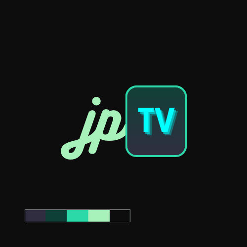

# JPTV Guide

This is the context color guide for JPTV page, follow the design constrains;

-   This page is "dark-first"
-   The color schema must be followed
-   This guide was though to be dev-first

### Dark theme



```css
:root {
    --main: #0d0d0d;
    --alter: #302d40;
    --accent: #114137;
    --title: #2cd8a8;
    --letter: #a7f1ba;
}
```

### Light theme


```css
:root[data-theme="light"] {
    --main: #ccd0d1;
    --alter: #8c959e;
    --accent: #f3bd1c;
    --title: #ffda53;
    --letter: #1a1c1a;
}
```
